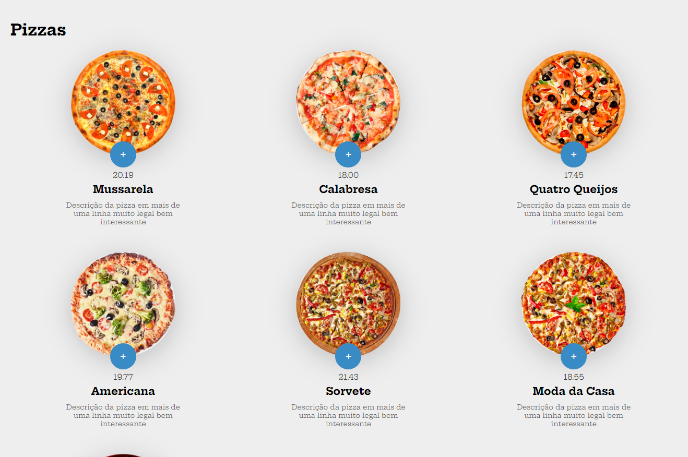
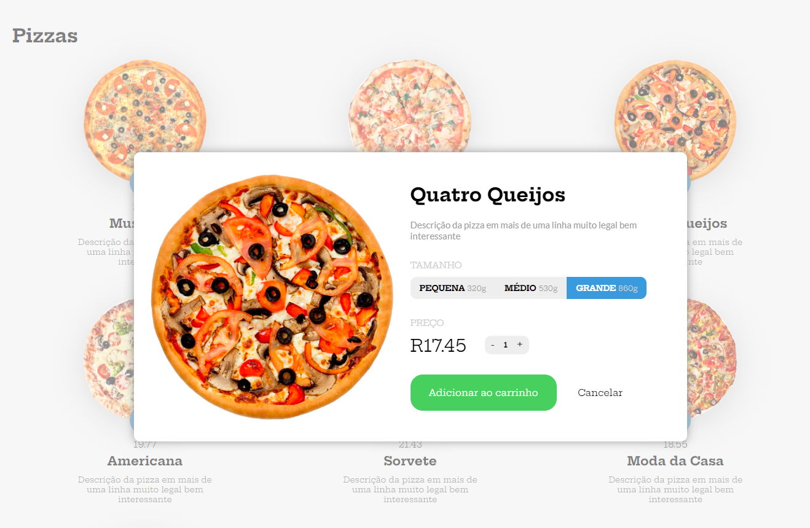
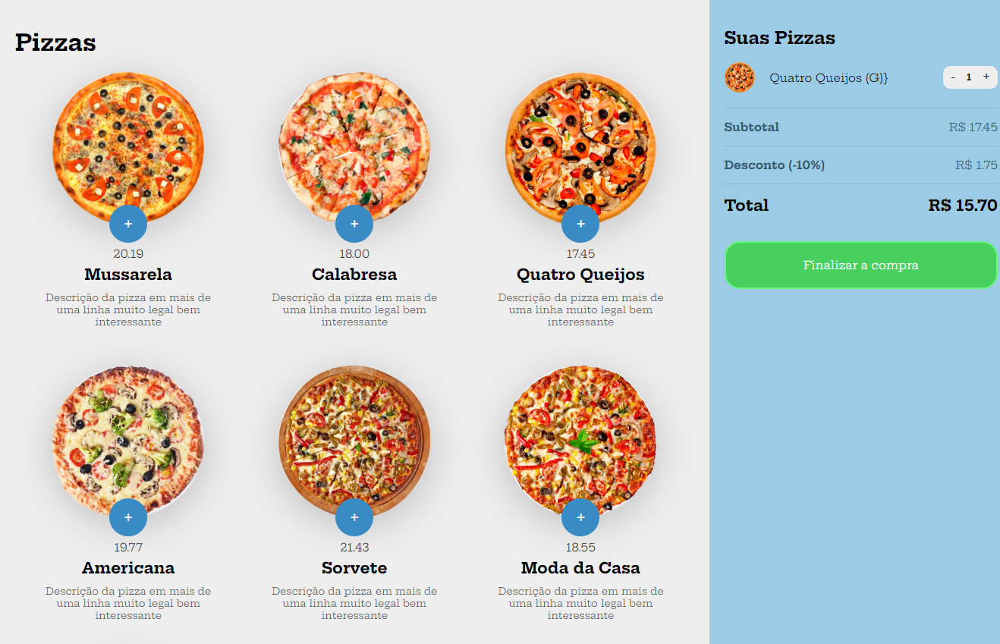
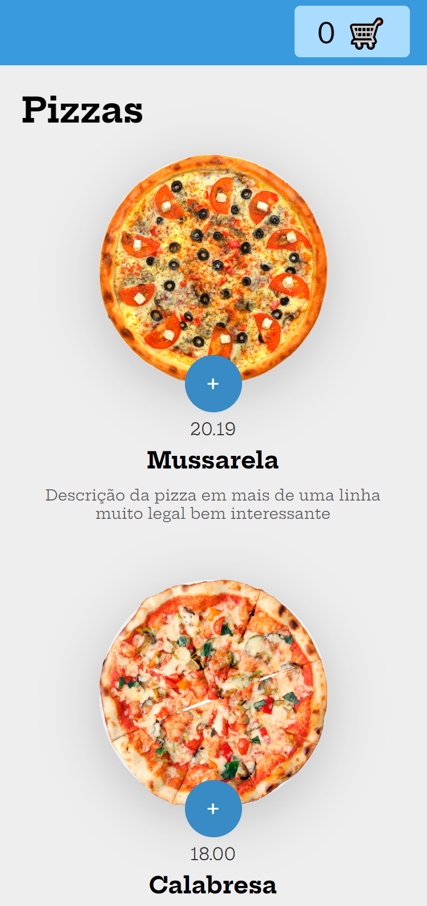
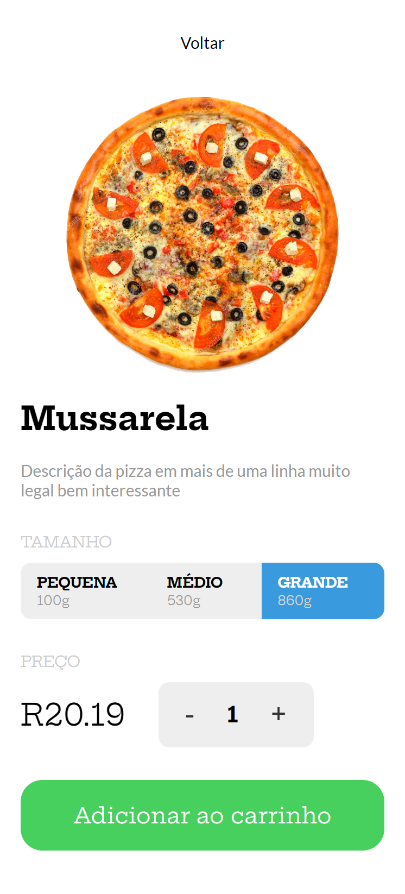

<h1 align="center">
    
</h1>

<h3 align="center">
    <a href="https://ismaelsilvas.github.io/pizzariaMenu/" target="_blank">Acessar projeto</a>
</h3>

<h1 align="center">Visão do Projeto
    
    

    
    

    
    

    
    

    
    

    
</h1>

## 🧾 Sobre

Projeto **Pizzaria Menu** criado dentro do módulo de Javascript do curso **B7Web** com o intuito de colocarmos em prática todo conhecimento estudo durante o módulo.

## ⚡ Tecnologias utilizadas

- HTML
- CSS
- Javascript

---

Desenvolvido por Ismael Silva.

